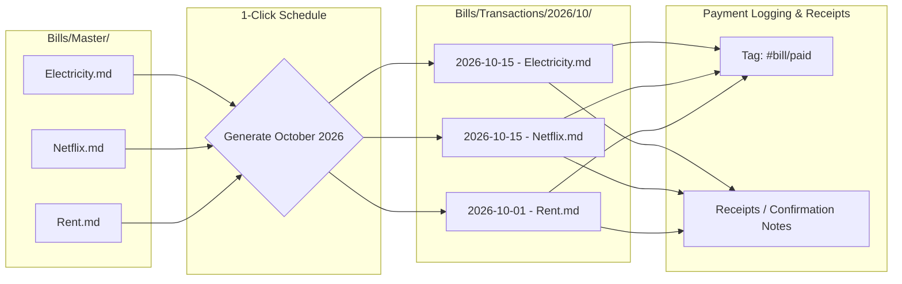

# Wawarts for Obsidian

A note-backed Obsidian plugin for tracking recurring bills, subscriptions, dues, and cashflow using a **Master Data & Transactional Instance** architecture.

Built following the design philosophy, UI craftsmanship, and vault-centric principles of **[DIWA](https://github.com/emperorKDSR/obsidian_diwa)**.

---

## 💡 Architecture & Philosophy



### 1. Master Data (`Bills/Master/`)
Maintain master templates for your recurring bills, subscriptions, and utilities. Each master note holds:
* Default/estimated cost & currency
* Billing frequency (Monthly, Yearly, Weekly, Bi-weekly, Quarterly, Custom)
* Scheduled due day of the month (e.g., Day 15)
* Default payment method & auto-pay configuration
* Account numbers, portal links, and customer support details

### 2. Transactional Instances (`Bills/Transactions/YYYY/MM/`)
Generate individual due files across time (e.g. for October 2026).
* Each due occurrence is an **isolated Markdown note** in your vault (e.g. `2026-10-15 - Electricity.md`).
* Holds live status (`pending`, `paid`, `overdue`), actual amount due, and references back to the master note `[[Electricity]]`.

### 3. Payment Settlement & Receipt Records
* When marked as paid, the file's frontmatter updates with `status: paid`, `paid_date`, and `amount_paid`.
* Tags automatically transition from `#bill/pending` to `#bill/paid`.
* Appends a formatted receipt and notes block into the file body where you can paste transaction confirmation numbers, screenshots, or PDF attachments.
* **The file itself is the immutable transactional record and audit trail of bills paid.**

---

## 📑 File Schemas

### Master Bill Note (`Bills/Master/Electricity.md`)
```yaml
---
type: master-bill
name: "Electricity Utility"
default_amount: 85.00
currency: "USD"
category: "Utilities"
frequency: "monthly"
due_day: 15
payment_method: "Checking Account"
auto_pay: false
reminder_days: 3
account_number: "ACC-99214"
active: true
tags:
  - bill/master
  - utilities
---

# Electricity Utility — Master Bill

> **Category:** Utilities | **Default Amount:** $85.00 (monthly)
> **Scheduled Due Day:** Day 15 of month
> **Payment Source:** Checking Account

## Description & Instructions
Utility account for main residence.
```

### Transaction Due Note (`Bills/Transactions/2026/10/2026-10-15 - Electricity.md`)
```yaml
---
type: bill-transaction
master_bill: "[[Electricity Utility]]"
due_date: "2026-10-15"
amount_due: 85.00
currency: "USD"
category: "Utilities"
status: "paid"
paid_date: "2026-10-14"
amount_paid: 85.00
payment_method: "Checking Account"
reference_no: "CONF-88219"
auto_pay: false
tags:
  - bill/transaction
  - bill/paid
  - due-2026-10
---

# Electricity Utility — Due: 2026-10-15

> [!NOTE] Bill Summary
> - **Master Item:** [[Electricity Utility]]
> - **Amount Due:** $85.00
> - **Status:** ⏳ Pending

## Notes & Verification
_Payment processed online via bank portal._

> [!SUCCESS] Payment Confirmation
> - **Paid On:** 2026-10-14
> - **Amount Paid:** $85.00 via **Checking Account** (Ref: `CONF-88219`)
> **Note:** Processed 1 day early.

## Receipt / Attachment
_Paste confirmation screenshot or billing invoice here._
```

---

## 🚀 Navigation & Commands

| Action | Ribbon / Command Palette |
| :--- | :--- |
| **Open Dashboard** | Ribbon icon or `Wawarts: Open Wawarts Dashboard` |
| **Generate Monthly Bills** | `Wawarts: Generate Monthly Bill Due Files` |
| **Add Master Bill** | `Wawarts: Add Master Bill Item` |
| **Record Payment** | `Wawarts: Record Payment for Due Bill` |
| **Status Bar Item** | Click status bar to view live monthly run rate & pending counts |

---

## 🛠️ Build & Development

```bash
npm install
npm run build
```
Generates `main.js`, `manifest.json`, and `styles.css`.
